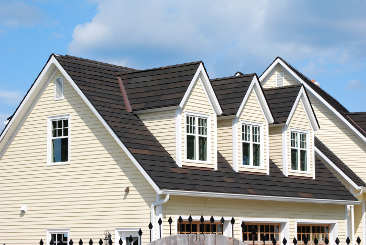

Dormer
======

    A large dormer roof on a suburban house

.. tip:: Dormer roofs come in a large variety of shapes and sizes, but the building procedure is the same. The tricky part is building dormer roofs on a diagonal.

* Find and mark the "corners" of the dormer roof closest to the edge of the roof in Minecraft. If it is less than 2 wide, mark the center of the wall with one block
* Figure out the angle of the dormer roof's walls perpindicular to the roof's edge, and mark the corners closest to the roof's surface. If it is less than 2 wide, mark the center of the wall with one block

Because dormer roofs vary so much from building to building, the rest of the contruction needs to be determined by you.